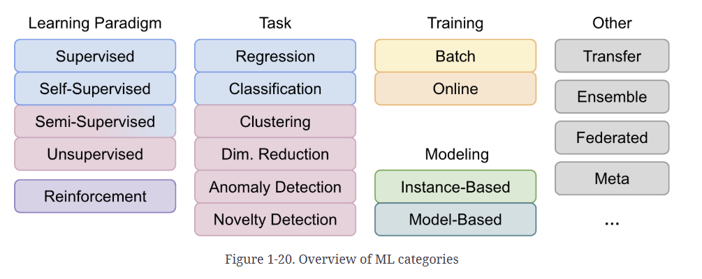

# Chapter 1 

## Glossary

- **CNN** - Convolutional Neural Networks, are a type of deep learning algorithm specifically designed for analyzing visual data like images and videos.
- **NLP** - Natural Language Processing is a subfield of computer science and artificial intelligence that enables computers to understand and generate human language
- **RNN** - A recurrent neural network (RNN) is a deep learning model that is trained to process and convert a sequential data input into a specific sequential data output.
- **Transformer** - The transformer is a deep learning architecture based on the multi-head attention mechanism. Text is converted to numerical representations called tokens, and each token is converted into a vector via lookup from a word embedding table
- **Generalization Error** - Error rate on the test set for a model. 
- **Training Error** - Error rate on the training set. 
- **Hyperparameter** = Hyperparameters are settings that determine how the model learns, and they are set before training starts. They can affect the model's architecture, learning rate, and other aspects of the training process. 

## Types Of Machine learning

### Supervised learning

Labeled data training
- Classification (logistic regression is commonly used for classification)
- Predict a target numeric value

### Unsupervised learning

Unlabeled data training
- Clustering algorithm to try to detect groups of similar visitors
- Visualization algorithms outputs a 2D or 3D representation of your data that can easily be plotted
** Feature Extraction ** - dimensionality reduction, in which the goal is to simplify the data without losing too much information. One way to do this is to merge several correlated features into one. 
- anomaly/novelty detection

### Semi-supervised learning

Partially Labeled data: For example, a clustering algorithm may be used to group similar instances together, and then every unlabeled instance can be labeled with the most common label in its cluster. Once the whole dataset is labeled, it is possible to use any supervised learning algorithm.

### Self-supervised learning

- Generating a fully labeled dataset from a fully unlabeled one, once the whole dataset is labeled, any supervised learning algorithm can be used.
- Large language models (LLMs) are trained in a very similar way, by masking random words in a huge text corpus and training the model to predict the missing words. This large pretrained model can then be fine-tuned for various applications.
**Transfer Learning** : So once model is performing well to output masked portion, it can be tweaked to perform any task (by mapping few other bits?)

### Reinforcement learning

The learning system can observe the environment, select and perform actions, and get rewards in return (or penalties in the form of negative rewards. It must then learn by itself what is the best strategy, called a policy, to get the most reward over time

### Batch learning

Offline learning, can't be trained with new data over old trained model, need to retrain from scratch. 

### Online learning

Learn on the fly, keeps learning. (usaully done Offline - more of an incremental leaning)
Advantage - adapts to new data, doesn't need high processing as data can be split up and trained in pieces unlike Batch leaning. 
Disadvantage - catastrophic forgetting (if leaning rate is high - it tends to forget the old bits), if bad data is fed system performance will decline. 

### Instance-based learning

Learning by heart - system learns examples by heart :: then generalizes to new cases by using a similarity measure to compare them to the learned examples (or a subset of them).
i.e predication is made on actually comparing with the training data - this needs deploying training set to prod and comparing which will be slow. 
Works if data is small and not need scaling. 

### Model-based learning

Instead of actually comparing with the training set, we build models of these examples and use those to make predication. 
Consider example of life satisfaction vs GDP
Let's say it depends on only one parameter, thus we select **Linear Model** - this is Model Selection.
- LS = c1 + c2* GDP  (linear function)

Traning the model mean choosing values of c1 and c2 based on your data. 
Once chosen we can simply make predication using GDP value for Life satisfaction.  (example in LinearRegression.ipynb)

### Ensemble learning

Ensemble learning is a technique that combines multiple machine learning models to improve the overall performance. The idea is to leverage the strengths of different models to create a more robust and accurate prediction system. Common methods include bagging, boosting, and stacking.

### Federated learning 

Federated learning is a distributed machine learning approach where multiple devices or servers collaboratively train a model while keeping the data localized. This method enhances privacy and security by ensuring that sensitive data does not leave the device, while still allowing for the benefits of collective learning.

### Meta-learning

A learning-to-learn approach where models learn how to learn new tasks quickly with minimal data.

## Main Challenges

- Data Based 

### Insufficient Training data

Mostly all of the machine learning algorithms behave the same way when trained on more and more data. As we train with more data algorithm becomes less significant and performance is similar. 
Thus, amount of data has much higher role on how model behave. 
But if data is less, algorithm plays a very important role. 

### Non-representive Training data

Training data should be representive of what predictions are to be made and this is very difficult. 

### Poor Quality Data

Lot of noise in the data. 

### Irrelevant Features

Feature selection, Feature Extraction are the key steps to remove irrelevant features. 

- Algorith based 

### Overfitting Data

The algorithm is too complex for the problem, starts finding the patterns that were not intended. 
Limit the algorithm to less dimentions. (Linear instead of multinomial)
*Regularization of Model* :  A set of techniques used to prevent overfitting in models, improving their ability to generalize to new, unseen data. It achieves this by adding a penalty to the model's complexity, encouraging it to learn broader patterns rather than memorizing the training data. This penalty is often added to the loss function, making the model less sensitive to noise in the training data. 
Amount of Regularization can be controlled by **Hyperparameter**. 

### Underfitting Data

- Very easy algorithm, add more dimentions
